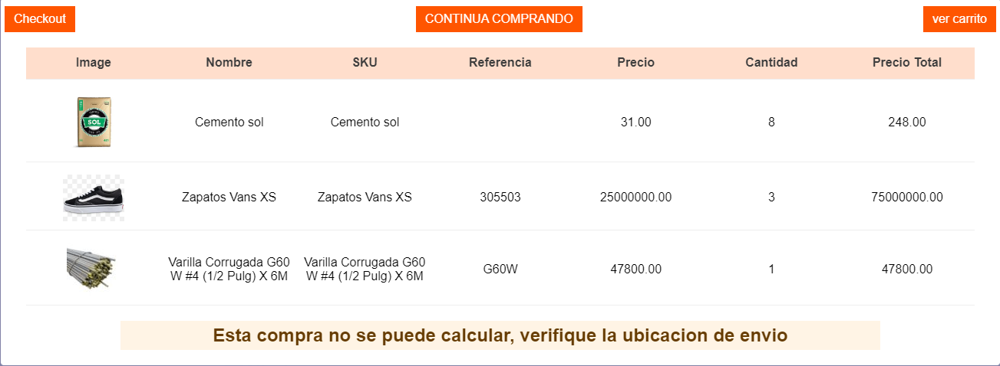

# add-to-cart-info

Informacion del carrito al hacer una comprar



## Configuration 

1. Añade a tu `manifest.json` la dependencia `itgloberspartnercl.add-to-cart-info`;
2. Para declarar este componente debes configurar las siguientes propiedades

## Uso 
```json
{
  "modal-layout":{
    "children":["add-to-cart-info"]
  }
}
```

## Customization


| CSS Handles |
| ----------- | 
| `container_table` | 
| `table` | 
| `table_header` | 
| `table_header_tr` | 
| `table_header_th` |
| `table_body` |
| `table_body_tr` |
| `table_body_td` |
| `table_body_image` |

